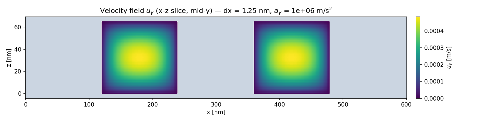
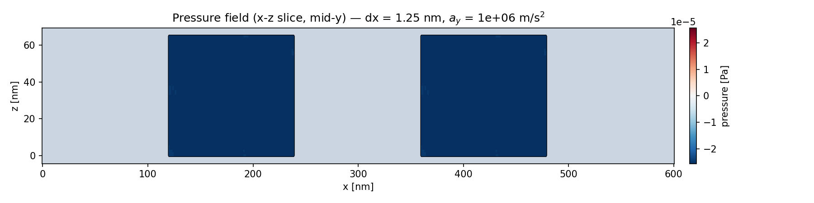
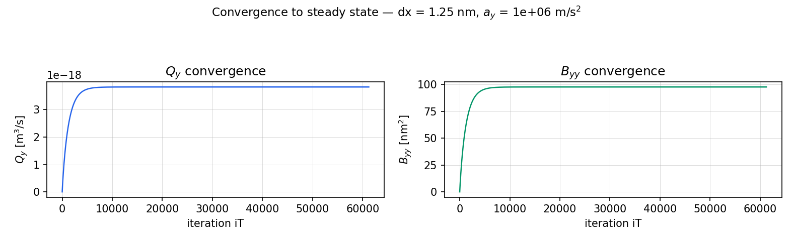
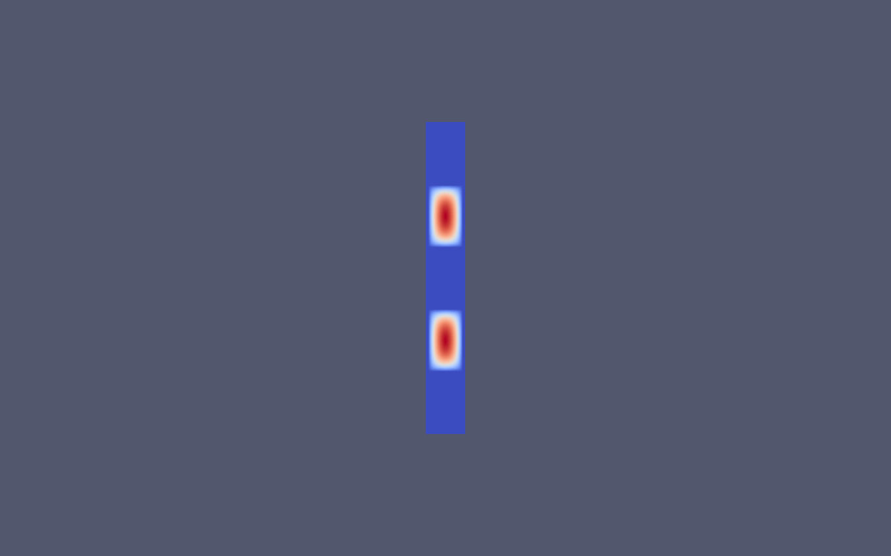

# SIM-EC1XT240 直沟槽纳米结构 — 最小闭环 DNS 算例（沿沟槽方向等效导流系数 B_yy）

本算例把参考版图 SIM-EC1XT240 的纳米沟槽阵列抽象成 **显式横向多沟槽单元**，
用 OpenLB 直接数值模拟（DNS）计算**沿沟槽方向（y）的等效导流系数 B_yy**。

- 只做**沿沟槽方向**流动（B_yy），不做横向（B_xx）。
- 单相、不可压、牛顿流体；**无**表面张力 / 接触角 / 自由面 / VOF / 压印运动。
- 驱动方式：恒定体积力（等价于压力梯度），沟槽方向（y）周期性。
- 固体壁面：无滑移（bounce-back）。

---

## 1. 几何参数表（已确认）

| 参数 | 符号 | 值 | 说明 |
|---|---|---|---|
| 固体墙宽度 | $w$ | **120 nm** | x 方向（横向），共 3 段墙 |
| 流体沟槽宽度 | $g$ | **120 nm** | x 方向（横向），共 2 段槽 |
| 横向总长 | $L_x$ | **600 nm** | $=3w+2g$ |
| 有效流体高度 | $H_{\rm fluid}$ | **65 nm** | z 方向（沟槽高） |
| 沿沟槽长度 | $L_y$ | **240 nm** | y 方向（周期边界） |
| 横向布局 | — | wall\|groove\|wall\|groove\|wall | 左/右外侧为无滑移固体壁 |

**横向（x）边界条件**：x **不设周期**，左/右外侧为 no-slip 固体壁；
**y** 方向周期；**z** 上下壁面 no-slip。

材料号：1 = 流体（沟槽），2 = 固体（无滑移墙）。

**计算域示意图**（x–z 截面，粉色=固体墙，蓝色=流体）：

```
wall(120) | groove(120) | wall(120) | groove(120) | wall(120)     Lx = 600 nm
```

---

## 2. OpenLB case 参数记录

| 类别 | 参数 | 值 |
|---|---|---|
| 求解器 | OpenLB 1.8r1，`Case`/`parameters`/`Mesh`/`Lattice` API | MPI + 双精度，CPU_SISD |
| 模型 | D3Q19 + `FORCE`，`ForcedBGKdynamics`（流体） | `boundary::BounceBack`（固体） |
| 材料号 | 1 = 流体，2 = 固体（无滑移） | `geometry.rename` |
| 周期 | x **非周期**，y 周期，z 非周期 | `setPeriodicity({false,true,false})` |
| 参考长度 | `PHYS_CHAR_LENGTH = 240 nm` | |
| 分辨率 | `RESOLUTION = 48` | $\Delta x = 5$ nm（120 nm=24 格、65 nm=13 格均整除；离散液高 14 节点） |
| 弛豫时间 | $\tau = 1.0$（$\omega=1$） | |
| 流体密度 | $\rho = 1000$ kg/m³ | |
| 运动黏度 | $\nu = 1\times10^{-6}$ m²/s | $\mu=\rho\nu=1\times10^{-3}$ Pa·s |
| 体力（物理加速度） | `BODY_FORCE_ACCEL = 1\times10^{8}` m/s²（+y） | 默认值；线性扫描用 1e6/1e7/1e8 |
| 重叠层 | `OVERLAP = 3` | |
| 收敛判定 | $Q_y$ 相对变化 < $1\times10^{-6}$ | |

---

## 3. 输出量定义

**体积流量**：

$$
Q_y = \frac{1}{L_y}\int_{\rm fluid} u_y\,\mathrm{d}V \qquad [\mathrm{m^3/s}]
$$

**表观（Darcy）通量 / 表观速度**（单位 m/s，非 m²/s）：

$$
q_y = \frac{Q_y}{A_{\rm cell}},\qquad A_{\rm cell}=L_x\,H_{\rm fluid}
$$

其中 $A_{\rm cell}=600{\rm nm}\times65{\rm nm}=3.9\times10^{-14}\,{\rm m^2}$ 为整个单元横截面积
（含固体墙，故 $q_y$ 是“表观速度”，量纲为 m/s）。

**流体平均速度 / 最大速度**（仅流体区）：

$$
u_{y,\rm fluid}^{\rm avg}=\frac{Q_y}{A_{\rm fluid}},\qquad
A_{\rm fluid}=n_g\,g\,H_{\rm fluid}=2\times120{\rm nm}\times65{\rm nm}
$$

$u_{y,\rm fluid}^{\max}$ 为流体区内 $u_y$ 的最大值。

---

## 4. B_yy 的计算公式与单位

**Darcy 形式（沿沟槽方向）**：

$$
q_y = -\frac{B_{yy}}{\mu}\,\frac{\partial p}{\partial y}
\quad\Longrightarrow\quad
B_{yy} = -\frac{\mu\, q_y}{\partial p/\partial y}
$$

- $q_y$：表观速度，单位 **m/s**。
- $\mu$：动力黏度，单位 **Pa·s**。
- $\partial p/\partial y$：沿沟槽方向压力梯度，单位 **Pa/m**。
- 因此 $B_{yy}$ 单位：$\dfrac{\rm (Pa\,s)(m/s)}{\rm Pa/m} = {\rm m^2}$。

**体积力 ↔ 压力梯度等价**（本算例用体积力驱动，无真实压力梯度）：

体积力密度（N/m³ = Pa/m）与压力梯度等价：$\partial p/\partial y = -\rho a_y$。
算例直接给定**物理加速度** $a_y$（`BODY_FORCE_ACCEL`），再由
$F_{\rm lat} = a_y\,\dfrac{\Delta t^2}{\Delta x}$ 换算成格子体积力
（$F_{\rm lat}$ 为格子体力；$\Delta x$、$\Delta t$ 由单位换算器给出）。

因此：

$$
B_{yy} = \frac{\mu\, q_y}{\rho\, a_y}
= \frac{\mu\, q_y}{\rho\,F_{\rm lat}\,\Delta x/\Delta t^2}
\qquad [\mathrm{m^2}]
$$

> 物理意义：$B_{yy}$ 是“单位压力梯度下、单位横截面积、单位黏度归一化的表观通量”，
> 量纲为 **长度²**（等效渗透率 / 导流系数）。

---

## 5. 雷诺数与体力线性验证

**雷诺数定义**（单条沟槽水力直径 $D_h$ + 流体平均速度）：

$$
D_h = \frac{2\,g\,H_{\rm fluid}}{g + H_{\rm fluid}},
\qquad
\mathrm{Re} = \frac{\rho\,u_{y,\rm fluid}^{\rm avg}\,D_h}{\mu}
$$

其中 $g=120{\rm nm}$、$H_{\rm fluid}=65{\rm nm}$，故 $D_h\approx 84.3{\rm nm}$。

**体力线性扫描**（`post/force_linearity.py`）：保持几何/网格/黏度/边界条件不变，
仅改变 $a_y = 10^6, 10^7, 10^8\,{\rm m/s^2}$，各跑到稳态。结果：

| $a_y$ [m/s²] | $Q_y$ [m³/s] | $q_y$ [m/s] | $u_{y,\rm fluid}^{\rm avg}$ [m/s] | $\mathrm{Re}$ | $B_{yy}$ [nm²] |
|---|---|---|---|---|---|
| $10^6$ | $4.385\times10^{-18}$ | $1.124\times10^{-4}$ | $2.811\times10^{-4}$ | $2.37\times10^{-5}$ | 112.437 |
| $10^7$ | $4.385\times10^{-17}$ | $1.124\times10^{-3}$ | $2.811\times10^{-3}$ | $2.37\times10^{-4}$ | 112.437 |
| $10^8$ | $4.385\times10^{-16}$ | $1.124\times10^{-2}$ | $2.811\times10^{-2}$ | $2.37\times10^{-3}$ | 112.437 |

三个工况 $B_{yy}$ 变化（(max−min)/mean）= **0.000%**（< 5%），且三个 $\mathrm{Re}\ll1$。
因此 **$B_{yy}=112.437\,{\rm nm^2}$ 可作为线性等效导流参数**；本算例雷诺数极低，无惯性影响。

产物：`tmp/force_linearity.csv`、`tmp/force_linearity.png`。

---

## 6. 网格收敛验证（严格等几何，液体高度精确 65 nm）

保持所有物理参数不变，仅加密网格 dx = 5.0 / 2.5 / 1.25 nm（`RESOLUTION = 48 / 96 / 192`，
dx = 240 nm / RESOLUTION）。墙宽/沟槽宽/液体高度/体力均不变（120 / 120 / **精确 65 nm**，
`BODY_FORCE_ACCEL = 1e6 m/s²`，y 周期，固体/上下壁 no-slip）。液体高度在三种网格下
均被 dx **整除**，因此离散液高严格等于 65 nm（5.0×13 = 2.5×26 = 1.25×52 = 65 nm）。

| dx [nm] | Nx×Ny×Nz | 离散墙宽 [nm] | 离散沟槽宽 [nm] | 离散液高 [nm] | B_yy [nm²] | 误差(vs 1.25nm) |
|---|---|---|---|---|---|---|
| 5.00 | 121×5×20 | 120 (24节点) | 120 (24节点) | 65.000 (14节点) | 112.437 | 15.18% |
| 2.50 | 241×9×33 | 120 (48节点) | 120 (48节点) | 65.000 (27节点) | 102.373 | 4.87% |
| 1.25 | 481×17×59 | 120 (96节点) | 120 (96节点) | 65.000 (53节点) | 97.616 | 0% |

说明：
- 墙宽/沟槽宽在三种网格下均为**精确 120 nm**（120 可被 5/2.5/1.25 整除）；
- 液体高度在三种网格下均为**精确 65.000 nm**（65 被 dx 整除为 13/26/52 个格子），
  消除了旧网格（dx=12/6/3）中液高被取整为 48/60/63 nm 带来的粗网格误差；
- 误差定义：`error = |B_current − B_fine| / |B_fine| × 100%`，参考为最细网格（1.25 nm）；
- B_yy 恒用 `B_yy = mu·qy/(rho·BODY_FORCE_ACCEL)`（单位 m²，无 m³，无 hEff）；
- y 方向（沟槽方向）取缩短长度 **Ly = 20 nm** 以加速最细网格：由于流动严格 y 不变
  （均匀 +y 体力、y 均匀几何、y 周期边界），B_yy 与 Ly 无关
  （已验证 dx=5 时 Ly=240 nm 与 Ly=20 nm 的 B_yy 均为 112.437 nm²）。

结论：
- **粗网格（5.0 nm）与细网格（1.25 nm）差异 = 15.18%**；
- **中网格（2.5 nm）与细网格（1.25 nm）差异 = 4.87%**；
- **B_yy 随网格加密趋于稳定**（误差 15.18% → 4.87% → 0% 单调下降），
  最细网格值 **B_yy ≈ 97.62 nm²**。

产物：`tmp/grid_convergence_exact65.csv`、`tmp/grid_convergence_exact65.png`。

（旧网格 dx=12/6/3 的结果 `tmp/grid_convergence.csv` 因液高被取整为 48/60/63 nm 而作废，不再使用。）

---

## 7. 目录结构

```
grooveDNS/
├── Makefile          # 指向 /home/dell/openlb 的 default.mk
├── grooveDns.cpp     # 主入口（initialize → createMesh → prepare → simulate）
├── case.h            # 核心逻辑：几何/格子/体力/测量/输出/B_yy
├── post/
│   ├── verify_geometry.py  # 几何验证（x-z截面/x-y俯视/材料统计/宽度测量）
│   ├── compute_byy.py      # 收敛曲线 + qy/B_yy 校验汇总
│   ├── force_linearity.py  # 体力线性扫描（3 个 a_y → csv + png）
│   ├── grid_convergence.py         # 网格收敛（旧 dx=12/6/3 nm，液高取整，已作废）
│   ├── grid_convergence_exact65.py # 严格等几何网格收敛（dx=5/2.5/1.25 nm，液高精确 65 nm）
│   └── final_results.py            # 正式结果后处理（细网格 1.25 nm 的 VTI + 图 + 副本）
├── verify/           # --geometry-only 输出的材料场与验证图
├── tmp/
│   ├── flowrate.dat      # Qy/qy/u_avg/u_max/B_yy 时间序列
│   ├── flowrate_ay*.dat  # 各 a_y 工况的时间序列副本
│   ├── force_linearity.csv / force_linearity.png
│   ├── grid_convergence.csv / grid_convergence.png               # 旧 dx=12/6/3（作废）
│   ├── grid_convergence_exact65.csv / grid_convergence_exact65.png
│   ├── byy_convergence.png / qy_convergence.png
│   ├── byy_summary.txt
│   └── final_*.vti / final_*_fine.png / final_flowrate_fine.dat / final_results_fine.txt  # 正式结果
└── README.md         # 本文件
```

## 8. 复现步骤

```bash
cd grooveDNS
make -j                          # 编译
./grooveDns --geometry-only      # 先验证几何（不运行 DNS）
python3 post/verify_geometry.py  # 检查 wall/groove 宽度 = 120 nm
./grooveDns                      # 运行 DNS，输出到 tmp/
python3 post/compute_byy.py      # 校验 qy = Qy/A_cell、输出 B_yy [m²] 与 [nm²]
python3 post/force_linearity.py          # 体力线性扫描 a_y=1e6/1e7/1e8 -> csv + png
python3 post/grid_convergence_exact65.py  # 网格收敛 dx=5/2.5/1.25 nm（液高精确 65 nm）-> csv + png

# 正式最终结果（细网格 dx=1.25 nm，跑稳态后自动写 final_results_fine.txt）
./grooveDns --RESOLUTION 192 --BODY_FORCE_ACCEL 1e6 --DOMAIN_LY 2.0e-08
python3 post/final_results.py             # 生成 VTI + 场图 + 收敛图 + 流量副本
```

> 验收要点：几何为 wall(120)-groove(120)-wall(120)-groove(120)-wall(120)；
> 固体墙内深部速度严格为 0（无穿透）；$q_y=Q_y/A_{\rm cell}$（m/s）；$B_{yy}$（m²）随时间趋于稳定；
> 网格收敛三行的 `height_nm` 必须全部为 **65.000**（dx=5/2.5/1.25 nm 均整除 65 nm）。

## 9. 正式最终结果（细网格 dx = 1.25 nm）

采用网格收敛最细工况（`RESOLUTION=192`，dx=1.25 nm，Ly=20 nm，`BODY_FORCE_ACCEL=1e6` m/s²）
跑到稳态（iT=61222，`ValueTracer` 收敛判据 ε=1e-6）后，`case.h` 直接写出 `tmp/final_results_fine.txt`，
`post/final_results.py` 再生成场图与 VTI 副本。最终 8 个正式输出：

| 输出 | 值 |
|---|---|
| $Q_y$ [m³/s] | 3.807040643612426×10⁻¹⁸ |
| $q_y = Q_y/A_{\rm cell}$ [m/s] | 9.761642675929298×10⁻⁵ |
| $u_{y,\rm fluid}^{\rm avg}$ [m/s] | 2.440410668982325×10⁻⁴ |
| $u_{y,\rm fluid}^{\rm max}$ [m/s] | 4.830259174569983×10⁻⁴ |
| Re | 2.057859807358068×10⁻⁵ |
| mass_relative_error | 3.330669073875470×10⁻¹⁵ |
| $B_{yy}$ [m²] | 9.761642675929298×10⁻¹⁷ |
| $B_{yy}$ [nm²] | **97.6164** |

其中 $A_{\rm cell}=L_x\cdot65{\rm nm}=3.9\times10^{-14}\,{\rm m^2}$，$B_{yy}=\mu q_y/(\rho a_y)$，
与网格收敛最细值 **97.616 nm²** 一致（差异 < 3×10⁻⁷ nm²，仅浮点舍入）。

产物（均在 `tmp/`）：`final_velocity_fine.vti`、`final_pressure_fine.vti`、
`final_velocity_field_fine.png`、`final_pressure_field_fine.png`、
`final_convergence_fine.png`、`final_flowrate_fine.dat`、`final_results_fine.txt`。

---

## SIM-EC1XT240 直沟槽 DNS 阶段性成果总结

### 1. 研究目的

建立 SIM-EC1XT240 的最小直沟槽 DNS 算例，研究液体沿沟槽方向的输运特性，并计算等效导流参数 B_yy，为后续纳米压印过程模拟提供基础。

### 2. 几何与物理模型

- 墙宽：120 nm；
- 沟槽宽：120 nm；
- 周期：240 nm；
- 剩余液膜厚度：65 nm；
- array=1：固体墙；
- array=0：流体沟槽；
- 流体模型：单相、不可压、牛顿流体；
- 固体墙和上下壁面：no-slip；
- y方向：周期边界；
- 驱动方式：沿y方向恒定体力；
- 不考虑压头运动、自由液面、接触角、表面张力、VOF和压印过程。

### 3. 数值计算过程

1. 从完整版图中抽象少数直沟槽周期单元；
2. 验证墙宽和沟槽宽均为120 nm；
3. 使用 OpenLB 建立单相直沟槽 DNS；
4. 施加沿y方向体力；
5. 记录速度场、压力场、流量和收敛过程；
6. 进行体力线性验证；
7. 进行严格等几何网格收敛验证；
8. 使用 ParaView 检查速度和压力切片。

### 4. 最终网格

最终采用严格等几何细网格：

- dx = 1.25 nm；
- 液膜高度 = 65 nm；
- 液膜高度由 52 个网格节点表示；
- 墙宽和沟槽宽均精确为120 nm。

### 5. 最终计算结果

| 结果量 | 数值 |
|---|---:|
| Q_y | 3.80704e-18 m³/s |
| q_y | 9.76164e-05 m/s |
| 流体平均速度 | 2.44041e-04 m/s |
| 流体最大速度 | 4.83026e-04 m/s |
| Re | 2.05786e-05 |
| 质量相对误差 | 3.33e-15 |
| B_yy | 9.76164e-17 m² |
| B_yy | 97.6164 nm² |

### 6. 计算公式

体力驱动时，体力与等效压力梯度的关系为：

\[
\frac{dp}{dy}=-\rho a_y
\]

表观流速为：

\[
q_y=\frac{Q_y}{A_{\mathrm{cell}}}
\]

其中：

\[
A_{\mathrm{cell}}=L_xH_{\mathrm{fluid}}
=600\ \mathrm{nm}\times65\ \mathrm{nm}
\]

等效导流参数为：

\[
B_{yy}
=-\mu\frac{q_y}{dp/dy}
=\frac{\mu q_y}{\rho a_y}
\]

B_yy 的单位为 m²。

### 7. 图片结果



最终速度场显示液体主要沿y方向流动，固体墙区域速度接近零。



压力场用于辅助检查流体区域和动态压力分布；本算例的驱动压力梯度通过体力等效施加。



流量和 B_yy 随计算时间逐渐稳定，最终达到收敛。



x-z截面显示沟槽中心速度最大，上下壁面速度接近零，符合no-slip边界下的抛物线速度分布。

### 8. 网格收敛

| dx | 液膜高度 | B_yy |
|---:|---:|---:|
| 5.00 nm | 65 nm | 112.44 nm² |
| 2.50 nm | 65 nm | 102.37 nm² |
| 1.25 nm | 65 nm | 97.62 nm² |

随着网格加密，B_yy逐渐趋于稳定。最终采用细网格结果：

\[
B_{yy}=97.6164\ \mathrm{nm^2}
\]

### 9. 阶段性结论

1. SIM-EC1XT240 直沟槽几何建模正确；
2. 固体墙区域没有明显流动；
3. 液体主要沿沟槽方向流动；
4. 沟槽内速度呈中心高、壁面低的抛物线分布；
5. 流量和速度场达到稳定；
6. 质量守恒误差极小；
7. 网格加密后 B_yy 趋于稳定；
8. 当前细网格下的最终结果为：

\[
\boxed{B_{yy}=97.6164\ \mathrm{nm^2}}
\]

当前模型是静态直沟槽输运DNS，不是压头下压过程。由于固体墙沿y方向连续，横向流动被阻断，当前理想结构理论上：

\[
B_{xx}=0
\]

### 10. 后续计划

- 阶段一：直沟槽基础DNS，已完成；
- 阶段二：横向阻断验证，验证 B_xx≈0；
- 阶段三：加入移动压头、自由液面、接触角、表面张力和VOF/Level Set，模拟真实压印填充过程。

---

## 阶段二：横向阻断验证（B_xx = 0）

### 目的

验证理想直沟槽结构中横向导流能力 B_xx = 0。直沟槽被沿 y 方向连续的固体墙分隔，
x 方向流动无法穿过固体墙，因此理论上横向表观流速 q_x = 0、B_xx = 0。

### 运行方式

新增独立运行模式，通过 `--CHECK_BXX` 触发，不影响默认沿 y 方向的 B_yy 运行：

```bash
./grooveDns --CHECK_BXX
```

该模式下：

- 施加 x 方向物理体力加速度 `a_x = 1.0e6 m/s²`（`BODY_FORCE_ACCEL_X`）；
- y 方向体力设为 0；
- 几何、网格、流体性质、边界条件与 B_yy 算例完全一致（墙/槽 120 nm、液膜 65 nm、
  y 周期、固体墙与上下壁 no-slip）。

### 物理预期

- 每个沟槽都是被 x 方向固体墙封闭的独立空腔，施加 +x 体力后流体无法产生净横向流动；
- 稳态为静水力学平衡：grad p = ρ a_x，速度场 u ≈ 0；
- 因此 Qx ≈ 0、qx = Qx/A_cell ≈ 0、B_xx ≈ 0。

### 数值结果

| 结果量 | 数值 |
|---|---:|
| a_x | 1.0e6 m/s² |
| Qx | 2.37501e-28 m³/s |
| qx | 6.08977e-15 m/s |
| max_abs_ux | 1.08896e-13 m/s |
| 质量相对误差 | 1.19792e-07 |
| B_xx 数值残差 | 6.08977e-27 m² |

其中 B_xx_num = μ·qx / (ρ·a_x) 是数值残差上限，不是真实导流系数。qx ≈ 6e-15 m/s
已接近机器精度（相比 B_yy 算例的 qy ≈ 1e-4 m/s 小约 10 个量级），因此判定：

\[
\boxed{B_{xx} = 0 \text{ within numerical tolerance}}
\]

（即 B_xx ≈ 6.1e-9 nm²，相比 B_yy = 97.6164 nm² 小约 10 个量级。）

### 结论

- 横向净流量 Qx 与表观流速 qx 均接近机器精度，验证了直沟槽结构对横向流动的阻断；
- B_xx 的数值残差上限 ≈ 6.1e-9 nm²，不可解释为真实横向导流（理想值为 0）；
- 该数值残差极小，不应被解读为真实的 B_xx。

产物：`tmp/bxx_blocking_results.txt`、`tmp/flowrate_bxx.dat`、
`tmp/bxx_blocking.png`、`tmp/final_velocity_bxx.vti`、
`tmp/final_velocity_field_bxx.png`。
